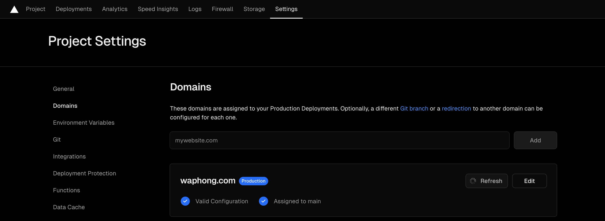
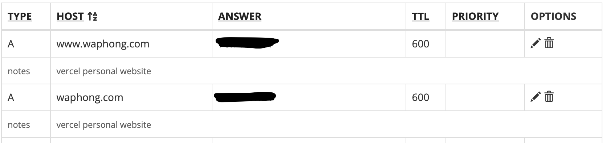
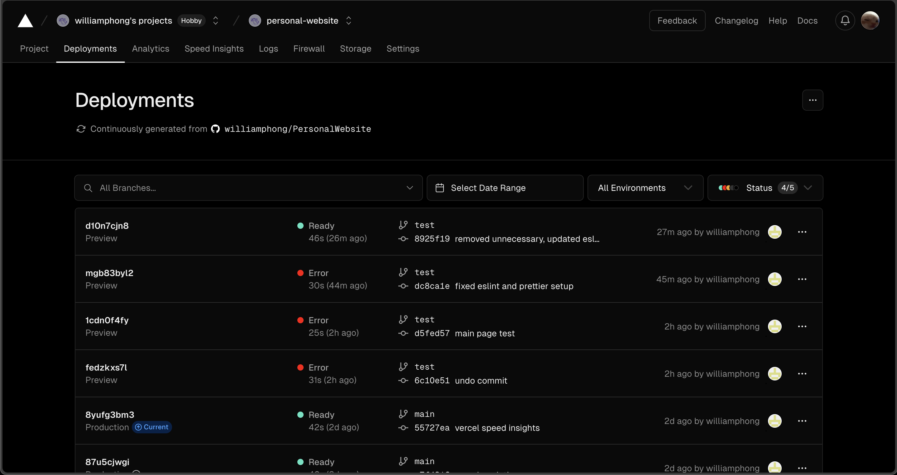
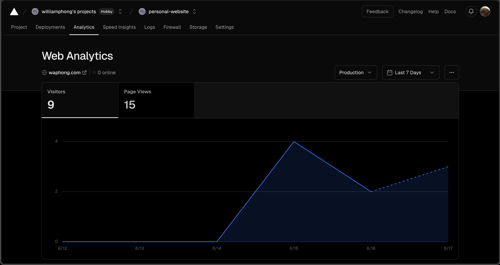

## Personal Website

Hi, my name is William Phong and this is my portfolio website! This was a project done to learn Next.js and Typescript. As such, much of the designing and coding comes from the websites that have inspired me - https://brittanychiang.com and https://carlbeaverson.com. ESLint and Prettier were also utilized to streamline my development process. Testing was done on my test branch and local npm server. This readme will go through my process and thoughts as I built this site.

## Vercel Deployment

This site was published using Vercel's hobby tier and Porkbun's domain registrar system.

Adding the DNS settings from Vercel to Porkbun was relatively straightforward. In Porkbun, I needed to create two A records with the host of "www" and "" with the answer provided by Vercel. Everything else was left default and after adding the records, Vercel would automatically detect and route.

After connecting a GitHub repository to Vercel, Vercel handles the branches within the repo and creates deployments for each one. The production deployment utilizes the main branch, which shows up on waphong.com The test branch creates preview deployments that are accessible through a link provided by vercel.

## Plugins

Vercel web and speed analytics are available by installing the plugins and placing them in the code.

